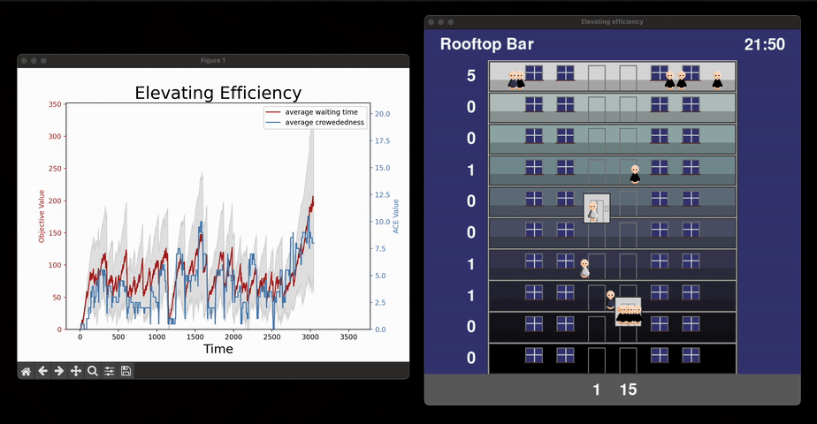

# Elevating Efficiency
Our project is about the efficiency of elevators. We want to find out how the efficiency of elevators can be improved by using different policies. We will simulate the movement of elevators and passengers in a building and compare the results of different policies.
This project was created as part of the course "Complex Social Systems: Modelling Agents, Learning and Games" at ETH Zurich.



## Installation
One can install the package by running the following command in the terminal (depending on the python installation, you might need to use pip3 instead of pip):
```pip install -r requirements.txt```

## Usage
To run the simulation first set the parameters in the main.py file. 
Important parameters are:
- `distribution`: The distribution of the passengers arrival times. Here you can choose one the scenarios Shopping Mall, Residential Building and Rooftop Bar.
- `policy`: The policy that is used to control the elevators. Here you can choose from one of the 4 letter policies e.g. `FCFSPolicy`.
- `policy_arguments`: The arguments that are passed to the policy, only use for `PWDPPolicy`, leave blank for others.
- `hours, minutes, seconds`: The duration of the simulation.

Then run the following command in the terminal from the project directory (depending on the python installation, you might need to use python3 instead of python):
```python main.py```

## Plotting
To plot simulations, call the corresponding functions in the `simulation_plotter.py` file.

Then run the following command in the terminal from the project directory (depending on the python installation, you might need to use python3 instead of python):
```python simulation_plotter.py```